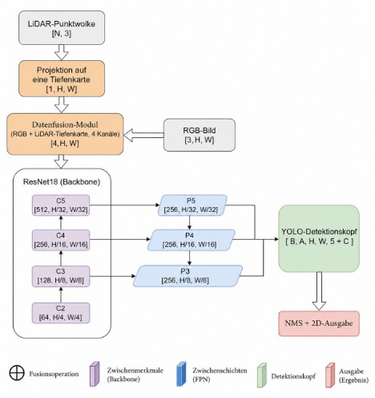
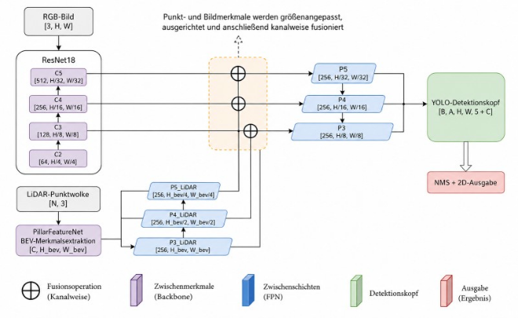
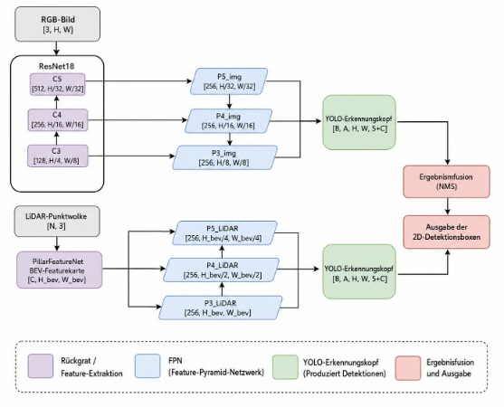

# RGB-LiDAR Multimodal Object Detection

A PyTorch research project comparing data, feature, and result fusion for vehicle detection using RGB images and LiDAR point clouds from KITTI. The implementation combines image feature pyramids, projected depth, and pillar-based LiDAR features to predict 2D bounding boxes for the **Car** class.

## Overview

The repository compares three fusion points for appearance and geometry, with KITTI calibration handling, anchor-based training, and evaluation across easy, moderate, and hard image subsets.

The current task is single-class **2D image-plane detection**. LiDAR BEV features provide geometric input; the detection heads do not predict 3D boxes.

### Highlights

- Implemented and compared three RGB-LiDAR fusion strategies: early, feature, and decision fusion.
- Evaluated on the KITTI Car detection task using a unified ResNet-18/FPN-based detection framework.
- Decision fusion achieved the highest overall AP@0.5 (**0.889**) and F1-score (**0.658**).
- Feature fusion reached the highest inference throughput at **117.2 FPS**.
- Early fusion achieved the highest F1-score (**0.698**) on the Moderate subset.

## Fusion Strategies

| Strategy | Implementation | Fusion mechanism |
| --- | --- | --- |
| Early / Data Fusion | `DataFusionResNetFPN` | Append projected LiDAR depth to RGB before feature extraction. |
| Feature Fusion | `FeatureFusionResNetFPN` | Pool LiDAR features to image stage sizes, concatenate them at three scales, and apply top-down fusion. |
| Decision / Result Fusion | `ResultFusionModel` | Predict independently from RGB and LiDAR branches, then merge decoded boxes using non-maximum suppression (NMS). |

## Architecture

The three models share a common ResNet-18/FPN-based detection framework while performing RGB-LiDAR fusion at different stages.

### Early / Data Fusion



RGB images and projected LiDAR depth are concatenated into a four-channel input before feature extraction.

### Feature Fusion



RGB and LiDAR features are extracted independently and fused at multiple feature-pyramid levels.

### Decision / Result Fusion



RGB and LiDAR branches perform detection independently, and their decoded predictions are merged using NMS.

### Implementation Details

- **Image backbone:** torchvision ResNet-18 with ImageNet pretrained weights.
- **Feature pyramid:** P3, P4, and P5 with 256 channels.
- **Depth preprocessing:** KITTI LiDAR points are projected into the image plane to generate a normalized depth map for early fusion.
- **LiDAR encoder:** pillar-based BEV representation with a lightweight MLP encoder.
- **Detection head:** YOLO-style anchor-based convolutional detection head.
- **Loss:** CIoU regression, focal objectness loss, and binary cross-entropy classification loss.

## Project Structure

```text
RGB-LiDAR-Multimodal-Object-Detection/
├── configs/       # YAML experiment settings and anchors
├── dataloader/    # KITTI loading, calibration parsing, and split generation
├── loss/          # Custom YOLO loss and supporting loss functions
├── models/        # Fusion backbones, data fusion, and detection heads
├── training/      # Strategy-specific builders and shared Trainer
├── testing/       # Evaluation, difficulty grouping, visualization, and plots
├── utils/         # Projection, fusion caches, anchor clustering, and metrics
└── main.py        # Small checkpoint inspection utility
```

## Dataset

KITTI data must be obtained separately and is not included in this repository. The training scripts expect the labeled samples arranged as follows, with matching sample IDs across modalities:

```text
data/
└── KITTI/
    ├── image_2/                  # RGB images (.png)
    ├── velodyne/                 # LiDAR scans (.bin)
    ├── label_2/                  # Object annotations (.txt)
    ├── calib/                    # Calibration files (.txt)
    └── kitti_split_6_2_2.json     # train, val, and test ID lists
```

The loader defaults to 256 × 256 images, rescales annotations, keeps only Car labels, and skips samples without valid Car boxes. The split script asserts 7,481 images and creates a 60/20/20 split using seed 42:

```bash
python -m dataloader.split_all
```

## Installation

The original experiments used **Python 3.9** and **PyTorch 2.3.1 with CUDA 12.1**. `requirements.txt` pins that PyTorch version; other dependencies remain unpinned because their tested versions are not recorded. Create a virtual environment using Python 3.9 from the repository root:

```bash
python -m venv .venv
```

Activate it in Windows PowerShell:

```powershell
.venv\Scripts\Activate.ps1
```

Or on Linux/macOS:

```bash
source .venv/bin/activate
```

Install the dependencies verified against the tracked source imports:

```bash
pip install -r requirements.txt
```

For GPU use, select a PyTorch/torchvision build compatible with your hardware and CUDA runtime. CUDA itself is not listed in the manifest. Model construction requests pretrained ResNet-18 weights, which must be available locally or downloadable by torchvision. This manifest does not establish a fully reproduced environment or compatibility across all platforms.

## Training

Run modules from the repository root. Entry points load `early_train_config.yaml`, `feature_train_config.yaml`, and `result_train_config.yaml`, respectively; there is no command-line config selector.

Before training, create the parent directories specified by `save_path`. Configure WandB or set `log_with_wandb: false` in the selected YAML file.

**Early fusion requires a complete fused cache** for valid training and validation samples:

```bash
python -m utils.fuse_preprocess_cache_kitti
```

The cache utility uses `data/KITTI/fused_cache_70_all/`, independently of YAML `cache_dir`. Precomputation is required because the early-training cache-miss callback returns an index instead of a sample.

```bash
python -m training.early_train
python -m training.feature_train
python -m training.result_train
```

These are separate experiments. Defaults are 50 epochs, batch size 24, and learning rate 0.0005. Additional YAML names and `backbone` fields do not select additional architectures in the current builders.

## Evaluation and Visualization

With matching checkpoints and dataset splits available:

```bash
python -m testing.test_early
python -m testing.test_feature
python -m testing.test_result
```

Scripts report precision, recall, F1, AP, and FPS by difficulty and for the full test split. Images are grouped by their hardest valid Car category. Matching uses **IoU > 0.5**; AP uses scikit-learn rather than the official KITTI evaluator. CUDA-specific timing calls make CUDA necessary for these entry points.

Training writes checkpoints under `results/early/`, `results/feature/`, and `results/result/`. Evaluation and visualization instead expect `results/{early,feature,result}_saved_model_best_f1.pth`; copy the relevant checkpoints there or adjust the relative paths in those scripts.

The `testing/vis_early.py`, `vis_feature.py`, and `vis_result.py` modules draw predictions on original images and save them by difficulty. They require `test_indices.npz`, which the evaluation scripts create when absent. The `testing/graph*.py` scripts provide log plotting and figure-processing utilities with script-specific inputs.

## Results

The three fusion strategies were evaluated on the KITTI test split using Precision, Recall, F1-score, AP@0.5, and inference speed (FPS).

### Overall Test Set

| Method | Precision | Recall | F1 | AP@0.5 | FPS |
| --- | ---: | ---: | ---: | ---: | ---: |
| Early / Data Fusion | 0.635 | 0.680 | 0.657 | 0.868 | 31.997 |
| Feature Fusion | 0.626 | 0.664 | 0.644 | 0.846 | **117.166** |
| Decision / Result Fusion | **0.636** | **0.682** | **0.658** | **0.889** | 86.892 |

### Key Findings

- **Early fusion** achieves strong precision and performs particularly well in relatively simple scenes, benefiting from early interaction between RGB appearance and projected LiDAR depth.
- **Feature fusion** provides the highest inference speed by a large margin, making it attractive for real-time or resource-constrained applications, although its detection accuracy is slightly lower.
- **Decision fusion** achieves the highest overall AP and F1-score on the full test set and performs especially well in more difficult scenes, while retaining substantially higher throughput than early fusion.


Model checkpoints and generated outputs under `results/` are excluded from Git tracking.

### Performance by KITTI Difficulty

| Difficulty | Method | Precision | Recall | F1 | AP@0.5 | FPS |
| --- | --- | ---: | ---: | ---: | ---: | ---: |
| Easy | Early Fusion | 0.603 | 0.758 | **0.672** | **0.944** | 30.421 |
| Easy | Feature Fusion | 0.596 | **0.761** | 0.668 | 0.923 | **98.412** |
| Easy | Decision Fusion | 0.543 | 0.758 | 0.633 | 0.940 | 68.869 |
| Moderate | Early Fusion | **0.648** | 0.756 | **0.698** | 0.887 | 28.845 |
| Moderate | Feature Fusion | 0.616 | 0.744 | 0.674 | 0.863 | **112.850** |
| Moderate | Decision Fusion | 0.633 | **0.770** | 0.695 | **0.909** | 80.131 |
| Hard | Early Fusion | 0.638 | **0.642** | 0.640 | 0.849 | 27.614 |
| Hard | Feature Fusion | 0.647 | 0.621 | 0.633 | 0.826 | **111.566** |
| Hard | Decision Fusion | **0.665** | 0.635 | **0.650** | **0.874** | 81.035 |

## Reproducibility

- Local absolute paths have been replaced with relative paths; checkpoint output locations remain config-driven. Run commands from the repository root.
- Files under `configs/` define experiment settings, including anchors, optimizer learning rate, epochs, AMP, logging, and checkpoint paths. Some model and data settings remain fixed in Python.
- Git excludes local datasets, checkpoint files, WandB logs, virtual environments, Python caches, generated outputs under `results/`, and `test_indices.npz`.
- Split generation uses a fixed seed, but training does not set a global random seed. Exact repeatability is not guaranteed.

## Notes

This is a cleaned public version of a graduation/research project. It preserves the experiment implementation; an end-to-end reproduction environment has not been validated.

## License

License information will be added separately.
